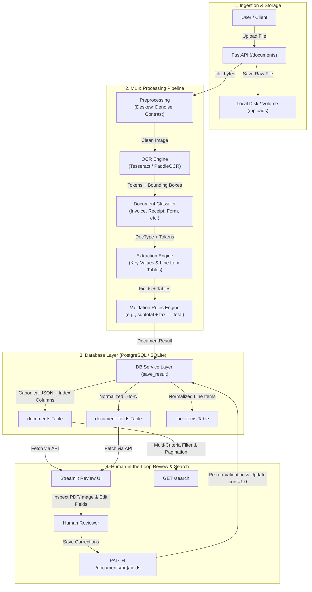

<<<<<<< HEAD
# Part C: Extraction & Validation Engine (`src/docint`)

This module handles structured field extraction, line-item table reconstruction, and business-rule validation for the DocSense pipeline. It consumes OCR tokens provided by Stage A and document classification labels provided by Stage B.


src/docint/
├── extraction/
│   ├── __init__.py       
│   ├── _tokens.py        
│   ├── extract.py         
│   ├── fields.py          
│   └── tables.py         
└── validation/
    ├── __init__.py        
    └── rules.py          


# Public API Contracts :

1. Extraction Interface
  docint.extraction.extract(doc_type: str,  tokens: list[dict]) -> tuple[dict, list]

  Inputs:
   Classified document type from Stage B and raw bounding-box tokens from Stage A.

  Outputs:
   fields: Extracted key-value pairs (e.g., invoice number, date, total amount).

   tables: Reconstructed line-item arrays.

2. Validation Interface
 docint.validation.validate(doc_type: str, fields: dict, tables: list) -> tuple[dict, bool]

  Inputs:
   Extracted field and table payload alongside the document classification.

  Outputs:
  validation_results: Detailed dictionary of checks performed.

 needs_review:
  Boolean flag indicating whether human review is required downstream.


# Testing & Fixtures:
The test suite includes complete end-to-end extraction and validation tests against fixture datasets (invoices, receipts, forms, certificates).

To run the full test suite locally:

Bash
$env:PYTHONPATH="src"; python -m pytest tests/


# Extensibility Guidelines:
  Adding New Field Rules:
   Update REGEX_PATTERNS or LABEL_FIELD_MAP in src/docint/extraction/fields.py.

  Adding New Document Types: 
   Define required field parameters in REQUIRED_FIELDS inside src/docint/validation/rules.py.

  Adding Custom Business Rules:
   Define custom validation functions in src/docint/validation/rules.py and register them under COMMON_RULES or RULES_BY_TYPE.


=======
# Smart Document & Form Intelligence System (DocSense)

Processes invoices, receipts, forms, and certificates: preprocessing → OCR/layout → classification → field & table extraction → validation → structured, searchable storage.

```
Upload → Preprocess → OCR → Classify → Extract → Validate → Store → Search / API / UI
```

---

## 🏛️ System Flow Diagram



---

## 🔄 End-to-End Processing Lifecycles

### 1. Ingestion Flow (`POST /documents`)
1. **Upload & Validation**: Client uploads a document (`.png`, `.jpg`, `.jpeg`, `.tif`, `.tiff`, `.bmp`, `.pdf`). FastAPI validates the extension (rejecting invalid types with `415`) and enforces a 20 MB size limit (`413`).
2. **Pipeline Execution**: The raw bytes pass to `process_document()`. Preprocessing decodes and cleans the page, OCR extracts bounding boxes, the classifier predicts document type, the extractor parses key-value fields and tables, and validation rules flag whether human verification is needed (`needs_review`).
3. **Atomic Persistence**:
   - The file is saved to `UPLOAD_DIR/<doc_id>.<ext>`.
   - `save_result()` writes the record to the database in a single atomic transaction: populating `DocumentRecord`, normalized `DocumentFieldRecord` rows, `LineItemRecord` rows, and indexed summary columns (`vendor`, `doc_date`, `total_amount`).
4. **Response**: Returns the complete `DocumentResult` JSON payload conforming to the data contract.

### 2. Human Review & Correction Flow (`PATCH /documents/{id}/fields`)
1. An operator selects a flagged document in the **Streamlit Review UI** (`src/docint/ui/app.py`).
2. The UI renders the source document side-by-side with extracted fields, highlighting low-confidence values ($< 0.60$) and failed validation checks.
3. The operator edits or confirms field values and clicks **Save Corrections**.
4. The API sets the edited fields' confidence to `1.0` (human-verified), automatically re-evaluates the validation rules via `docint.validation.rules.validate()`, recalculates `needs_review`, and atomically updates the database.

### 3. Search & Query Flow (`GET /search`)
- Supports structured SQL filters: `vendor` (case-insensitive partial match), `doc_type`, `needs_review`, `date_from` / `date_to`, `min_amount` / `max_amount`, and full-text keyword search (`q`).
- Returns a paginated envelope:
  ```json
  {
    "total": 42,
    "limit": 20,
    "offset": 0,
    "items": [
      {
        "doc_id": "...",
        "filename": "invoice_01.png",
        "doc_type": "invoice",
        "needs_review": false,
        "vendor": "ACME Traders",
        "doc_date": "2026-09-01",
        "total_amount": 1180.0,
        "created_at": "2026-09-29T20:26:50Z"
      }
    ]
  }
  ```

---

## 👥 Team Ownership & Modules

| Area | Owner | Code Location | Branch Prefix |
|---|---|---|---|
| **Architecture, Integration & Evaluation** | **Lead** | `src/docint/pipeline.py`, `src/docint/evaluation/`, `docs/`, `.github/` | `feature/pipeline-*` |
| **Preprocessing + OCR** | **Person A** | `src/docint/preprocessing/`, `src/docint/ocr/` | `feature/preprocess-*`, `feature/ocr-*` |
| **Classification + Layout** | **Person B** | `src/docint/classifier/` | `feature/classifier-*` |
| **Extraction + Validation** | **Person C** | `src/docint/extraction/`, `src/docint/validation/` | `feature/extract-*`, `feature/validation-*` |
| **API + DB + UI + Docker** | **Person D** | `src/docint/api/`, `src/docint/db/`, `src/docint/ui/`, `Dockerfile` | `feature/api-*`, `feature/db-*`, `feature/ui-*` |

---

## 🚀 Quick Start (Local Development)

```bash
git clone <repo-url> && cd docsense
python -m venv .venv
source .venv/bin/activate          # Windows: .venv\Scripts\activate
pip install -r requirements.txt
pytest                              # run test suite (71 passing)
uvicorn docint.api.main:app --reload --app-dir src
```

Open http://127.0.0.1:8000/docs to explore the interactive OpenAPI / Swagger documentation.

---

## 📊 Evaluation & Benchmarking

The repository includes a 30-document ground-truth benchmark suite (`data/labels/`) and an automated scorecard runner:

```bash
# Run evaluation across the benchmark suite
python src/docint/evaluation/runner.py

# Export a markdown report
python src/docint/evaluation/runner.py --report eval_report.md
```

Target metrics are defined in [`docs/evaluation.md`](docs/evaluation.md):
- **OCR Quality**: Character Error Rate (CER) $< 3.0\%$, Word Error Rate (WER) $< 6.0\%$
- **Classification**: Macro $F_1 > 0.92$, Accuracy $> 95.0\%$
- **Field Extraction**: Normalized Key Field $F_1 > 90.0\%$
- **Straight-Through Processing (STP)**: Zero-touch automation rate $> 80.0\%$

---

## 🐳 Docker (API + PostgreSQL)

```bash
# Start API + PostgreSQL
docker compose up --build

# Start with the Streamlit Review UI included
docker compose --profile ui up --build
```

| Service | Port / URL |
|---|---|
| FastAPI Application (Swagger Docs) | http://localhost:8000/docs |
| Streamlit Review Dashboard | http://localhost:8501 |
| PostgreSQL Database | `localhost:5432` |

```bash
# Tear down services and reset volumes
docker compose down -v
```

---

## 🖥️ Streamlit Review UI (Local)

The review UI communicates with the backend exclusively over HTTP:

```bash
pip install -r requirements-ui.txt
streamlit run src/docint/ui/app.py
```

Set `API_URL` if your FastAPI instance runs on a different port or host:
```bash
API_URL=http://localhost:8000 streamlit run src/docint/ui/app.py
```

---

## ⚙️ Environment Variables

| Variable | Default | Description |
|---|---|---|
| `DATABASE_URL` | `sqlite:///./docint.db` | SQLAlchemy connection string (SQLite or PostgreSQL) |
| `UPLOAD_DIR` | `./uploads` | Directory where uploaded files are stored on disk |
| `API_URL` | `http://localhost:8000` | API base URL consumed by the Streamlit review dashboard |

---

## 📜 Development Rules

1. **`src/docint/schemas.py` is the contract**: Do NOT modify it without whole-team alignment (see [`docs/schema.md`](docs/schema.md)).
2. **Preserve module signatures**: Add optional parameters instead of altering existing parameter signatures.
3. **Branch & PR workflow**: Never push directly to `main` without review (see [`CONTRIBUTING.md`](CONTRIBUTING.md)).
4. **All tests must pass**: Run `pytest` before opening any PR.
>>>>>>> origin/main
